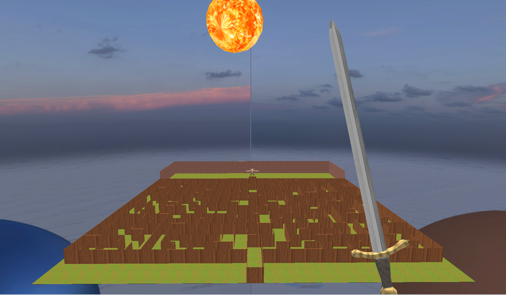
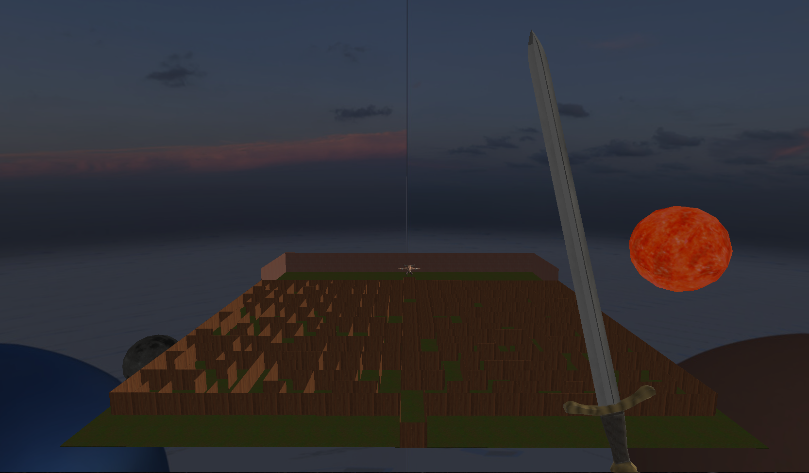
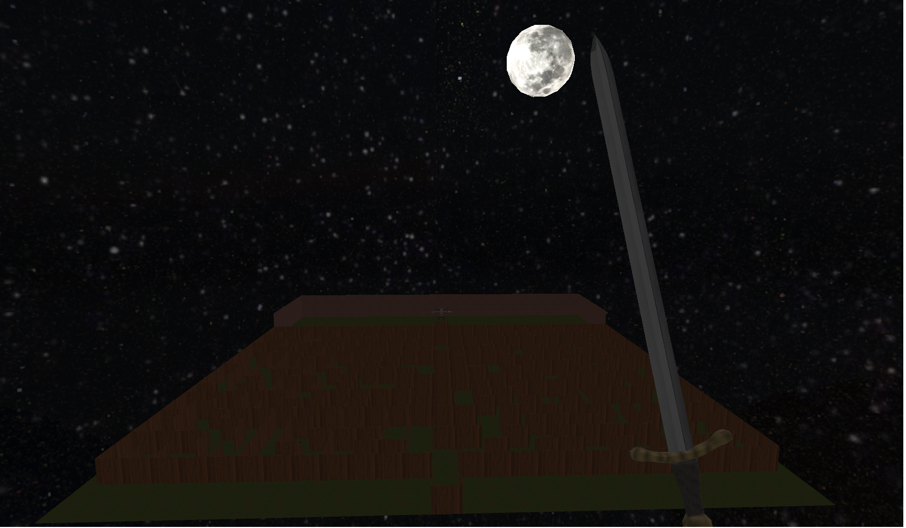
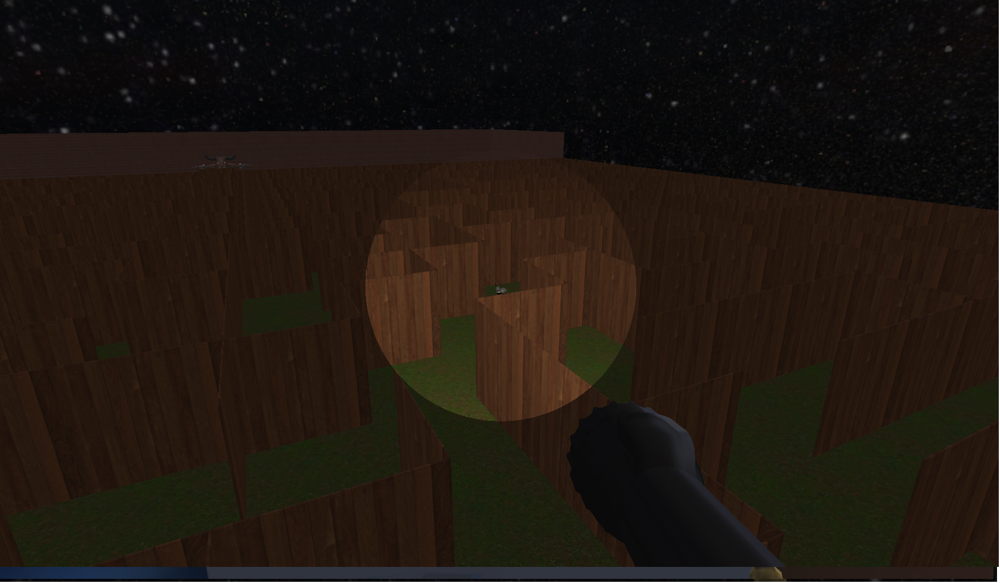
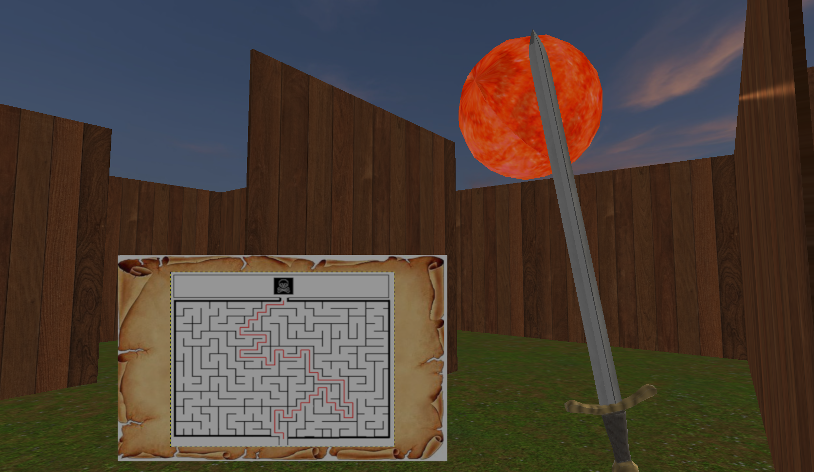
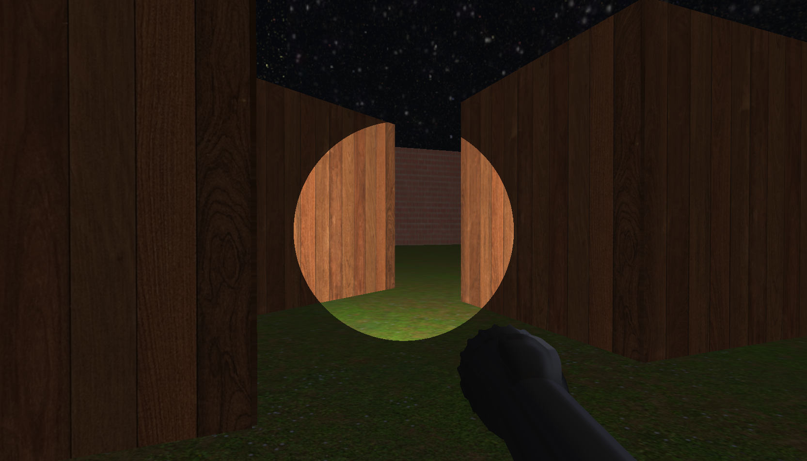
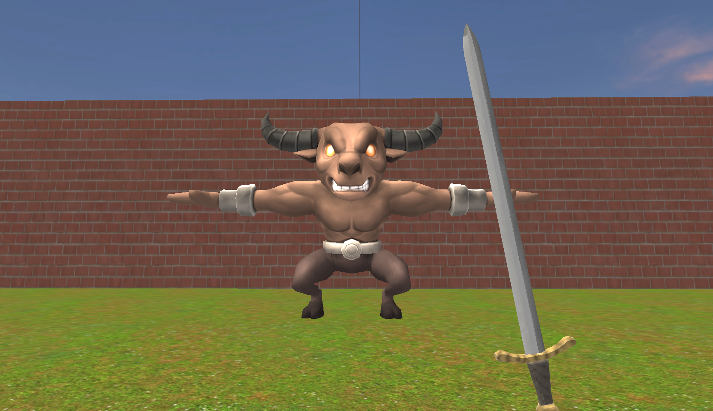

# Trabalho Final para a cadeira de Fundamentos de Computação Gráfica (INF01047) da UFRGS.

## Sobre o jogo:
  Um jogo de labirinto, em que o objetivo é coletar até 10 coelhos espalhados aleatoriamente pelo mapa. Cada coelho abre um pouco uma parede secreta que dá acesso ao Boss do jogo.
Ao matar o Boss, o jogo é reiniciado após alguns segundos, com mais 10 coelhos em novos lugares.

## Usabilidade:
### Questões de Jogabilidade:
 - Movimentação com teclado WASD e mouse
 - Botão esquerdo do mouse para usar a espada
 - Botão TAB para trocar da espada para a lantena e vice-versa
 - Botão F para ligar/desligar a lanterna
 - Botão M para abrir o mini-mapa do labirinto

### Questões de Implementação:
 - Shift Q para mudar o modelo de interpolação
 - Shift E para abrir a porta secreta
 - Shift R para mostrar o caminho do início até o fim do labirinto
 - Shift L para mudar para a câmera Look-at
 - Shift C para mudar para a câmera livre

  ## Critérios Técnicos
- [x] Malhas poligonais complexas - Modelos OBJ do minotauro, coelhos, esferas e paredes (cubos).
- [x] Transformações geométricas controladas pelo usuário - Ataque da espada, abrir porta secreta.
- [x] Câmera livre e câmera look-at - Livre: Permite movimentação sem colisões e voar. Look-At: Fixada no Boss no fim do labirinto.
- [x] Instâncias de objetos - Usado para gerar as paredes do labirinto e os coelhos.
- [x] Três tipos de testes de intersecção - 
- [x] Modelos de Iluminação Difusa e Blinn-Phong - Coelhos possuem iluminação difusa, e quando iluminada pela lanterna mudam para Blinn-Phong.
- [x] Modelos de Interpolação de Phong e Gouraud - Possível alterar com o teclado
- [x] Mapeamento de texturas em todos os objetos - Todos os objetos possuem texturas
- [x] Movimentação com curva Bézier cúbica - Duas curvas de Bézier para simular o efeito circular do Sol e da Lua
- [x] Animações baseadas no tempo ($\Delta t$) - Movimentação, Morte do Minotauro

Ambos trabalhamos em quase todos os pontos do trabalho.
Seguem alguns pontos específicos que mexemos isoladamente:

### Anderson:
- [x] Codificação do Labirinto
- [x] Câmera look-at
- [x] Curvas de Bézier Cúbicas
- [x] SkyBox

### Luca: 
- [x] Colisões
- [x] Modelos de Intepolações
- [x] Movimentação

 
## Imagens

Ciclo de Dia e Noite.
  
  
  

Lanterna ilumina mais forte o que está perto do player.
  

Olhando o Mapa para encontrar o caminho.

Porta secreta que abre ao matar os coelhos pelo labirinto.

Boss no final do labirinto.

